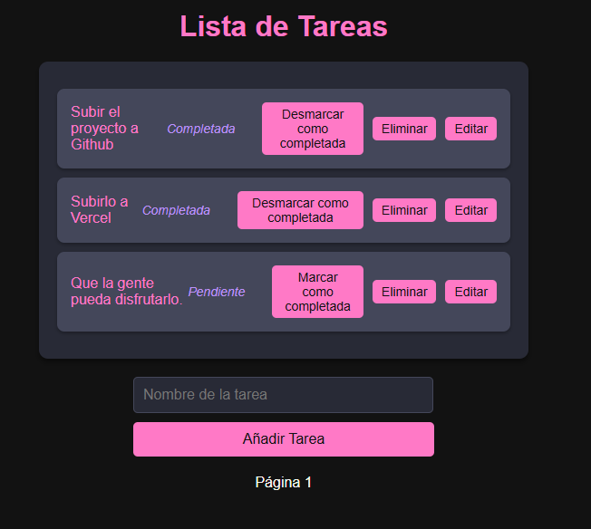
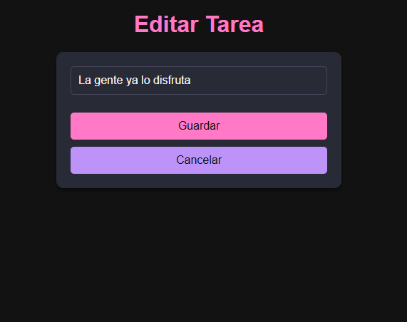

# 📝 ToDoApp

Una aplicación web sencilla para gestionar tareas diarias. Implementada con **HTML**, **Java**, y **Thymeleaf**, esta app permite crear, editar, marcar como completas y eliminar tareas con una interfaz muy intuitiva.

---

## 🌟 Características

- **Añadir tareas**: Crea nuevas tareas para mantenerte organizado.
- **Editar tareas**: Cambia los detalles de tus tareas.
- **Eliminar tareas**: Limpia tu lista eliminando las tareas completadas o innecesarias.
- **Marcar como completadas**: Lleva un control visual de las tareas que ya terminaste.
- **Desmarcar tareas completadas**: Si necesitas volver a trabajar en una tarea, ¡sin problemas!

---

## 🚀 Tecnologías Usadas

- **Backend**: Java + Spring Boot.
- **Frontend**: HTML + Thymeleaf.
- **Base de Datos**: PostgreSQL.

---

## 🖼️ Capturas de Pantalla

### 1️⃣ Vista principal: Lista de Tareas

---

### 2️⃣ Editar una tarea

---